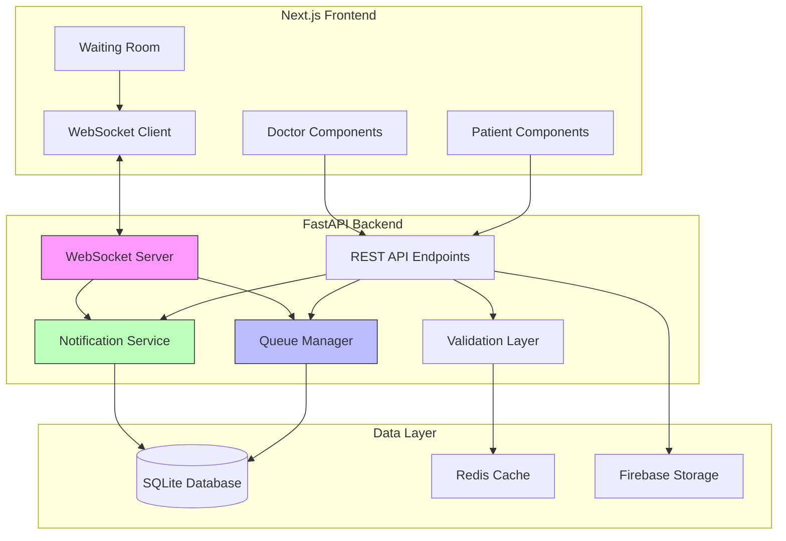

# Design Document: Real-Time Appointment Queue System

## Overview

This design document describes the technical architecture for enhancing the existing appointment system with real-time queue management, Google Meet integration, waiting room functionality, and comprehensive appointment history tracking. The system builds upon the existing FastAPI backend, Next.js frontend, SQLite database, and Firebase integration.

The design focuses on:
- Real-time communication using WebSocket connections
- Efficient queue position calculation and notification delivery
- Seamless integration with existing appointment and consultation models
- Robust handling of edge cases and network failures
- Performance optimization for concurrent users

## Architecture

### High-Level Architecture



### Component Responsibilities

**Queue Manager**:
- Calculate queue positions for all waiting patients
- Manage token number assignments and reassignments
- Ensure no duplicate tokens for same doctor/day
- Handle concurrent queue operations atomically

**Notification Service**:
- Send real-time notifications via WebSocket
- Store notification history in database
- Batch notifications for efficiency
- Handle notification delivery failures with retry logic

**Validation Layer**:
- Validate Google Meet link format
- Check doctor meet link configuration before consultations
- Validate queue operations (no duplicate tokens, valid positions)
- Cache validation results for performance

**WebSocket Server**:
- Maintain persistent connections with active patients
- Broadcast queue updates to relevant patients
- Handle connection drops and reconnections
- Implement heartbeat mechanism for connection health

## Components and Interfaces

### Backend Components

#### 1. Queue Manager Service

```python
class QueueManager:
    """Manages appointment queue positions and token assignments"""
    
    def calculate_position(self, patient_token: int, current_token: int) -> int:
        """Calculate queue position for a patient"""
        return patient_token - current_token
    
    def get_current_serving_token(self, doctor_id: str, date: str) -> int:
        """Get the current token being served by doctor"""
        pass
    
    def assign_new_token(self, doctor_id: str, date: str) -> int:
        """Assign new token number (max + 1)"""
        pass
    
    def reassign_patient(self, appointment_id: str) -> int:
        """Reassign patient to end of queue"""
        pass
    
    def get_patients_in_range(self, doctor_id: str, date: str, 
                              current_token: int, range_size: int) -> List[Appointment]:
        """Get patients within range of current token"""
        pass
    
    def validate_no_duplicates(self, doctor_id: str, date: str, token: int) -> bool:
        """Ensure no duplicate token numbers"""
        pass
```

#### 2. Notification Service

```python
class NotificationService:
    """Handles real-time notification delivery"""
    
    def send_position_update(self, patient_id: str, appointment_id: str, 
                            position: int, current_token: int):
        """Send queue position update notification"""
        pass
    
    def send_your_turn(self, patient_id: str, appointment_id: str, meet_link: str):
        """Send urgent 'your turn' notification"""
        pass
    
    def send_missed_appointment(self, patient_id: str, appointment_id: str):
        """Send missed appointment notification"""
        pass
    
    def send_meet_link_update(self, patient_ids: List[str], new_link: str):
        """Notify multiple patients of meet link update"""
        pass
    
    def store_notification(self, patient_id: str, appointment_id: str, 
                          type: str, message: str) -> Notification:
        """Persist notification to database"""
        pass
    
    def get_unread_notifications(self, patient_id: str) -> List[Notification]:
        """Retrieve unread notifications for patient"""
        pass
```

#### 3. Meet Link Validator

```python
class MeetLinkValidator:
    """Validates and manages Google Meet links"""
    
    MEET_LINK_PATTERN = r'^https://meet\.google\.com/[a-z]{3}-[a-z]{4}-[a-z]{3}$'
    
    def validate_format(self, meet_link: str) -> bool:
        """Validate Google Meet URL format"""
        return re.match(self.MEET_LINK_PATTERN, meet_link) is not None
    
    def get_doctor_meet_link(self, doctor_id: str) -> Optional[str]:
        """Get cached or fetch doctor's meet link"""
        pass
    
    def update_meet_link(self, doctor_id: str, meet_link: str) -> bool:
        """Update and validate doctor's meet link"""
        pass
    
    def has_valid_meet_link(self, doctor_id: str) -> bool:
        """Check if doctor has configured valid meet link"""
        pass
```

#### 4. WebSocket Manager

```python
class WebSocketManager:
    """Manages WebSocket connections and broadcasts"""
    
    active_connections: Dict[str, WebSocket] = {}
    
    async def connect(self, patient_id: str, websocket: WebSocket):
        """Register new WebSocket connection"""
        pass
    
    async def disconnect(self, patient_id: str):
        """Remove WebSocket connection"""
        pass
    
    async def send_personal_message(self, patient_id: str, message: dict):
        """Send message to specific patient"""
        pass
    
    async def broadcast_to_patients(self, patient_ids: List[str], message: dict):
        """Broadcast message to multiple patients"""
        pass
    
    async def heartbeat(self, patient_id: str):
        """Send heartbeat to check connection health"""
        pass
```

### Frontend Components

#### 1. Waiting Room Interface

```typescript
interface WaitingRoomProps {
  appointmentId: string;
  patientToken: number;
}

interface WaitingRoomState {
  currentToken: number;
  queuePosition: number;
  estimatedWaitTime: number;
  doctorStatus: 'available' | 'busy' | 'on_break';
  meetLink: string | null;
  canJoin: boolean;
}

const WaitingRoomInterface: React.FC<WaitingRoomProps> = ({
  appointmentId,
  patientToken
}) => {
  // WebSocket connection for real-time updates
  // Display current token, patient token, progress bar
  // Show estimated wait time
  // Enable/disable join button based on turn
  // Display doctor status
  // Message box for doctor communication
}
```

#### 2. Notification Banner

```typescript
interface Notification {
  id: string;
  type: 'position_update' | 'your_turn' | 'missed' | 'doctor_status';
  message: string;
  priority: 'low' | 'medium' | 'high' | 'urgent';
  timestamp: Date;
}

const NotificationBanner: React.FC = () => {
  // Display in-app notifications
  // Request browser notification permissions
  // Play sound alerts for urgent notifications
  // Auto-dismiss low priority notifications
  // Persist notification history
}
```

#### 3. Meet Link Configuration Modal

```typescript
interface MeetLinkConfigProps {
  doctorId: string;
  currentLink: string | null;
  onUpdate: (newLink: string) => void;
}

const MeetLinkConfigModal: React.FC<MeetLinkConfigProps> = ({
  doctorId,
  currentLink,
  onUpdate
}) => {
  // Input field for Google Meet link
  // Real-time validation
  // Save and update functionality
  // Show notification about patient alerts
}
```

#### 4. Appointment History Card

```typescript
interface AppointmentHistoryProps {
  appointment: {
    id: string;
    doctorName: string;
    specialization: string;
    date: Date;
    mode: 'online' | 'in_person';
    clinicalNotes: string;
    aiAnalysis: string;
    prescription: Prescription;
  };
}

const AppointmentHistoryCard: React.FC<AppointmentHistoryProps> = ({
  appointment
}) => {
  // Display appointment details
  // Show clinical notes with markdown rendering
  // Display AI analysis
  // Show prescription with medications
  // Download prescription as PDF
}
```

#### 5. Queue Position Indicator

```typescript
interface QueuePositionProps {
  currentToken: number;
  patientToken: number;
  totalInQueue: number;
}

const QueuePositionIndicator: React.FC<QueuePositionProps> = ({
  currentToken,
  patientToken,
  totalInQueue
}) => {
  // Visual progress bar
  // Highlight patient position
  // Show current serving token
  // Animate position changes
}
```

## Data Models

### Database Schema Updates

#### Appointments Table (Extended)

```sql
ALTER TABLE appointments ADD COLUMN meet_link_updated_at TIMESTAMP;
ALTER TABLE appointments ADD COLUMN patient_notified_at TIMESTAMP;
ALTER TABLE appointments ADD COLUMN waiting_room_joined_at TIMESTAMP;
ALTER TABLE appointments ADD COLUMN late_arrival_count INTEGER DEFAULT 0;
ALTER TABLE appointments ADD COLUMN reassignment_history TEXT; -- JSON array
```

#### Consultations Table (Extended)

```sql
ALTER TABLE consultations ADD COLUMN waiting_room_entered_at TIMESTAMP;
ALTER TABLE consultations ADD COLUMN meet_link_at_consultation TEXT;
ALTER TABLE consultations ADD COLUMN patient_ready_at TIMESTAMP;
```

#### New Notifications Table

```sql
CREATE TABLE notifications (
    id TEXT PRIMARY KEY,
    patient_id TEXT NOT NULL,
    appointment_id TEXT NOT NULL,
    type TEXT NOT NULL CHECK(type IN ('position_update', 'your_turn', 'missed', 'doctor_status')),
    message TEXT NOT NULL,
    priority TEXT NOT NULL CHECK(priority IN ('low', 'medium', 'high', 'urgent')),
    read BOOLEAN DEFAULT FALSE,
    created_at TIMESTAMP DEFAULT CURRENT_TIMESTAMP,
    FOREIGN KEY (patient_id) REFERENCES users(id),
    FOREIGN KEY (appointment_id) REFERENCES appointments(id)
);

CREATE INDEX idx_notifications_patient ON notifications(patient_id);
CREATE INDEX idx_notifications_appointment ON notifications(appointment_id);
CREATE INDEX idx_notifications_read ON notifications(read);
```

### Pydantic Models

#### Notification Model

```python
class NotificationType(str, Enum):
    POSITION_UPDATE = "position_update"
    YOUR_TURN = "your_turn"
    MISSED = "missed"
    DOCTOR_STATUS = "doctor_status"

class NotificationPriority(str, Enum):
    LOW = "low"
    MEDIUM = "medium"
    HIGH = "high"
    URGENT = "urgent"

class Notification(BaseModel):
    id: str
    patient_id: str
    appointment_id: str
    type: NotificationType
    message: str
    priority: NotificationPriority
    read: bool = False
    created_at: datetime
```

#### Queue Position Model

```python
class QueuePosition(BaseModel):
    appointment_id: str
    patient_token: int
    current_token: int
    position: int
    estimated_wait_minutes: int
    can_join: bool
```

#### Reassignment History Entry

```python
class ReassignmentEntry(BaseModel):
    timestamp: datetime
    old_token: int
    new_token: int
    reason: str
    requested_by: str  # patient_id or doctor_id
```

### TypeScript Interfaces

#### WebSocket Message Types

```typescript
interface WSMessage {
  type: 'queue_update' | 'your_turn' | 'meet_link_update' | 'doctor_status';
  payload: any;
  timestamp: string;
}

interface QueueUpdatePayload {
  currentToken: number;
  patientToken: number;
  position: number;
  estimatedWaitMinutes: number;
  canJoin: boolean;
}

interface YourTurnPayload {
  appointmentId: string;
  meetLink: string;
  message: string;
}

interface MeetLinkUpdatePayload {
  newMeetLink: string;
  updatedAt: string;
}

interface DoctorStatusPayload {
  status: 'available' | 'busy' | 'on_break';
  expectedReturnTime?: string;
}
```

## API Specifications

### New REST Endpoints

#### 1. Update Meet Link

```
POST /api/consultation/{consultation_id}/update-meet-link
Authorization: Bearer <doctor_token>

Request Body:
{
  "meet_link": "https://meet.google.com/abc-defg-hij"
}

Response:
{
  "success": true,
  "meet_link": "https://meet.google.com/abc-defg-hij",
  "updated_at": "2024-01-15T10:30:00Z",
  "patients_notified": 10
}
```

#### 2. Get Queue Notifications

```
GET /api/consultation/queue/notifications/{appointment_id}
Authorization: Bearer <patient_token>

Response:
{
  "notifications": [
    {
      "id": "notif_123",
      "type": "position_update",
      "message": "Currently token #5 is ongoing, you are 8 positions away",
      "priority": "low",
      "read": false,
      "created_at": "2024-01-15T10:25:00Z"
    }
  ],
  "unread_count": 3
}
```

#### 3. Mark Patient as No-Show

```
POST /api/consultation/{consultation_id}/mark-no-show
Authorization: Bearer <doctor_token>

Request Body:
{
  "appointment_id": "appt_456",
  "reason": "Patient did not join within 2 minutes"
}

Response:
{
  "success": true,
  "appointment_id": "appt_456",
  "status": "no_show",
  "notification_sent": true
}
```

#### 4. Reassign Patient to Queue

```
POST /api/appointments/{appointment_id}/reassign-queue
Authorization: Bearer <patient_token>

Request Body:
{
  "reason": "Late arrival - requesting reassignment"
}

Response:
{
  "success": true,
  "old_token": 15,
  "new_token": 42,
  "estimated_wait_minutes": 120,
  "message": "You have been reassigned to token #42"
}
```

#### 5. Get Appointment History

```
GET /api/appointments/{patient_id}/history?limit=20&offset=0
Authorization: Bearer <patient_token>

Response:
{
  "appointments": [
    {
      "id": "appt_789",
      "doctor_name": "Dr. Smith",
      "specialization": "Cardiology",
      "date": "2024-01-10T14:00:00Z",
      "mode": "online",
      "clinical_notes_url": "https://...",
      "ai_analysis_url": "https://...",
      "prescription": {
        "medications": [...],
        "lifestyle_advice": "...",
        "follow_up": "..."
      }
    }
  ],
  "total": 45,
  "has_more": true
}
```

#### 6. Mark Patient Ready

```
POST /api/consultation/{consultation_id}/patient-ready
Authorization: Bearer <patient_token>

Request Body:
{
  "appointment_id": "appt_456"
}

Response:
{
  "success": true,
  "waiting_room_entered_at": "2024-01-15T10:28:00Z",
  "current_token": 12,
  "your_token": 15,
  "position": 3
}
```

#### 7. Validate Doctor Meet Link

```
GET /api/doctor/{doctor_id}/validate-meet-link
Authorization: Bearer <doctor_token>

Response:
{
  "has_meet_link": true,
  "meet_link": "https://meet.google.com/abc-defg-hij",
  "is_valid": true,
  "last_updated": "2024-01-15T09:00:00Z"
}
```

### WebSocket Endpoints

#### Connect to Queue Updates

```
WS /ws/queue/{appointment_id}
Authorization: Bearer <patient_token>

Server Messages:
{
  "type": "queue_update",
  "payload": {
    "currentToken": 12,
    "patientToken": 15,
    "position": 3,
    "estimatedWaitMinutes": 15,
    "canJoin": true
  }
}

{
  "type": "your_turn",
  "payload": {
    "appointmentId": "appt_456",
    "meetLink": "https://meet.google.com/abc-defg-hij",
    "message": "Your consultation is starting now - Join immediately!"
  }
}
```

## Algorithms and Logic

### Queue Position Calculation

```python
def calculate_queue_position(patient_token: int, current_token: int) -> int:
    """
    Calculate the position of a patient in the queue.
    
    Args:
        patient_token: The token number assigned to the patient
        current_token: The token number currently being served
    
    Returns:
        The number of patients ahead in queue (0 means it's patient's turn)
    """
    position = patient_token - current_token
    return max(0, position)  # Never return negative position

def should_notify_patient(position: int, last_notified_position: int) -> bool:
    """
    Determine if patient should receive a notification based on position change.
    
    Notification thresholds:
    - Position > 10: Notify every 5 positions
    - Position 5-10: Notify every position change
    - Position 1-4: Notify every position change
    - Position 0: Urgent notification
    """
    if position == 0:
        return True  # Always notify when it's their turn
    elif position <= 4:
        return position != last_notified_position  # Every change
    elif position <= 10:
        return position != last_notified_position  # Every change
    else:
        # Notify every 5 positions when far away
        return (position % 5 == 0) and (position != last_notified_position)
```

### Estimated Wait Time Calculation

```python
def calculate_estimated_wait_time(
    position: int,
    avg_consultation_minutes: int = 10,
    current_consultation_elapsed: int = 0
) -> int:
    """
    Calculate estimated wait time for a patient.
    
    Args:
        position: Number of patients ahead in queue
        avg_consultation_minutes: Average consultation duration
        current_consultation_elapsed: Minutes elapsed in current consultation
    
    Returns:
        Estimated wait time in minutes
    """
    if position == 0:
        return 0
    
    # Time remaining for current consultation
    current_remaining = max(0, avg_consultation_minutes - current_consultation_elapsed)
    
    # Time for patients ahead (excluding current)
    ahead_time = (position - 1) * avg_consultation_minutes
    
    return current_remaining + ahead_time
```

### Token Assignment Algorithm

```python
def assign_new_token(doctor_id: str, date: str, db: Session) -> int:
    """
    Assign a new token number ensuring no duplicates.
    
    Algorithm:
    1. Query max token for doctor on date
    2. Increment by 1
    3. Verify no duplicate (race condition check)
    4. Return new token
    """
    # Use database transaction for atomicity
    with db.begin():
        max_token = db.query(func.max(Appointment.queue_number))\
            .filter(
                Appointment.doctor_id == doctor_id,
                func.date(Appointment.appointment_date) == date
            )\
            .scalar() or 0
        
        new_token = max_token + 1
        
        # Verify no duplicate (should never happen with transaction)
        exists = db.query(Appointment)\
            .filter(
                Appointment.doctor_id == doctor_id,
                func.date(Appointment.appointment_date) == date,
                Appointment.queue_number == new_token
            )\
            .first()
        
        if exists:
            raise ValueError(f"Duplicate token {new_token} detected")
        
        return new_token
```

### Meet Link Update Notification Logic

```python
async def notify_patients_of_meet_link_update(
    doctor_id: str,
    date: str,
    current_token: int,
    new_meet_link: str,
    notification_service: NotificationService,
    db: Session
):
    """
    Notify next 10 patients when doctor updates meet link.
    
    Algorithm:
    1. Get patients with tokens in range [current_token, current_token + 10]
    2. Filter for online appointments only
    3. Send notification to each patient
    4. Update meet_link_updated_at timestamp
    """
    patients_to_notify = db.query(Appointment)\
        .filter(
            Appointment.doctor_id == doctor_id,
            func.date(Appointment.appointment_date) == date,
            Appointment.queue_number > current_token,
            Appointment.queue_number <= current_token + 10,
            Appointment.mode == "online",
            Appointment.status.in_(["scheduled", "waiting"])
        )\
        .all()
    
    patient_ids = [apt.patient_id for apt in patients_to_notify]
    
    await notification_service.send_meet_link_update(
        patient_ids=patient_ids,
        new_link=new_meet_link
    )
    
    # Update timestamps
    for apt in patients_to_notify:
        apt.meet_link_updated_at = datetime.utcnow()
    
    db.commit()
```


## Correctness Properties

A property is a characteristic or behavior that should hold true across all valid executions of a system—essentially, a formal statement about what the system should do. Properties serve as the bridge between human-readable specifications and machine-verifiable correctness guarantees.

### Property 1: Meet Link Verification for Online Consultations

*For any* doctor attempting to start an online consultation, if the doctor does not have a configured meet link, the system should prevent the consultation from starting.

**Validates: Requirements 1.2**

### Property 2: Meet Link Update Notifications

*For any* doctor who updates their meet link during an active session, the notification service should notify exactly the next N patients in the waitlist, where N is the minimum of 10 and the number of waiting patients.

**Validates: Requirements 1.3**

### Property 3: In-Person Consultation Bypass

*For any* doctor starting an in-person consultation, the system should allow the consultation to proceed without meet link validation.

**Validates: Requirements 1.5**

### Property 4: Join Button State Based on Queue Position

*For any* patient with a queue position, the "Join Appointment" button should be enabled if and only if the queue position is 10 or less.

**Validates: Requirements 2.1, 2.2**

### Property 5: Waiting Room Information Completeness

*For any* waiting room interface rendering, the display should contain the current token being served, the patient's token number, and the estimated wait time.

**Validates: Requirements 2.4**

### Property 6: Position-Based Notification Content

*For any* patient with a queue position greater than 10, notifications should state the current token and the number of positions away.

**Validates: Requirements 3.1**

### Property 7: Urgent Notification Frequency

*For any* patient with a queue position between 1 and 10 inclusive, the notification service should send frequent notifications with ready status messages.

**Validates: Requirements 3.2**

### Property 8: Queue Advancement on Consultation Completion

*For any* consultation that is finished by a doctor, the queue manager should automatically advance to the next patient in the queue.

**Validates: Requirements 4.5**

### Property 9: Consultation Completion Side Effects

*For any* completed consultation, the appointment status should be updated to "completed" and the prescription should become available to the patient.

**Validates: Requirements 4.6**

### Property 10: No-Show Marking for Absent Patients

*For any* appointment where the patient's turn arrives and the doctor finishes without the patient joining, the system should mark the appointment as "No Show".

**Validates: Requirements 5.1**

### Property 11: No-Show Notification Delivery

*For any* appointment marked as "No Show", the notification service should send a notification stating the appointment was missed.

**Validates: Requirements 5.2**

### Property 12: Token Reassignment Algorithm

*For any* patient requesting reassignment, the queue manager should assign a new token number equal to the current maximum queue number for that doctor and date plus one.

**Validates: Requirements 5.4**

### Property 13: Reassignment History Persistence

*For any* token reassignment operation, the system should record the reassignment details (old token, new token, timestamp, reason) in the appointment's reassignment history.

**Validates: Requirements 5.5**

### Property 14: Appointment History Completeness

*For any* completed appointment displayed in history, the rendering should include doctor's name, specialization, date, time, consultation mode, prescribed medications with dosage/frequency/duration, and lifestyle/dietary advice.

**Validates: Requirements 7.2, 7.5, 7.6**

### Property 15: Queue Position Calculation Formula

*For any* patient token number and current serving token number, the queue position should equal the patient token minus the current token (with a minimum of 0).

**Validates: Requirements 8.1**

### Property 16: Token Uniqueness Invariant

*For any* doctor and date, all assigned token numbers should be unique (no duplicates).

**Validates: Requirements 8.3**

### Property 17: Meet Link Format Validation

*For any* string submitted as a Google Meet link, the validation should correctly identify whether it matches the Google Meet URL format pattern.

**Validates: Requirements 9.1**

### Property 18: Meet Link Update Timestamp Recording

*For any* doctor meet link update, the system should store the update timestamp in the meet_link_updated_at field.

**Validates: Requirements 9.2**

### Property 19: Meet Link Snapshot Preservation

*For any* consultation, the system should preserve a snapshot of the meet link that was active at the time the consultation started.

**Validates: Requirements 9.3**

### Property 20: Notification Read Status Update

*For any* notification displayed to a patient, the system should mark that notification as read.

**Validates: Requirements 10.3**

### Property 21: Waiting Room Entry Timestamp Recording

*For any* patient joining the waiting room, the system should record the waiting_room_entered_at timestamp.

**Validates: Requirements 11.1**

### Property 22: Patient Readiness Timestamp Recording

*For any* patient indicating readiness, the system should record the patient_ready_at timestamp.

**Validates: Requirements 11.2**

### Property 23: Consultation Duration Calculation

*For any* consultation with recorded start and end times, the calculated duration should equal the end time minus the start time.

**Validates: Requirements 11.5**

### Property 24: Queue Position Preservation Across Disconnections

*For any* patient who disconnects from the waiting room and reconnects, their queue position should be preserved and match their original token number.

**Validates: Requirements 12.1**

### Property 25: Concurrent Join Ordering

*For any* set of patients attempting to join simultaneously, the system should process them in strict order based on their token numbers (lowest token first).

**Validates: Requirements 12.3**

### Property 26: Late Join Allowance

*For any* patient who joins after their turn has arrived but before being marked as no-show, the system should allow them to proceed with the consultation.

**Validates: Requirements 12.6**

### Property 27: Reassignment History Serialization Round Trip

*For any* valid reassignment history data structure, encoding it to JSON and then decoding it should produce an equivalent data structure.

**Validates: Requirements 14.1**

### Property 28: Notification Data Completeness

*For any* notification being stored, all required fields (patient_id, appointment_id, type, message, priority, timestamp) should be present and non-null.

**Validates: Requirements 14.4**

### Property 29: Timezone Conversion Preservation

*For any* timestamp, converting it between timezones and back should preserve the actual moment in time (the UTC representation should remain unchanged).

**Validates: Requirements 14.5**

## Error Handling

### Meet Link Validation Errors

**Scenario**: Doctor provides invalid Google Meet link format

**Handling**:
- Validate link format using regex pattern
- Return clear error message: "Invalid Google Meet link format. Expected: https://meet.google.com/xxx-xxxx-xxx"
- Prevent saving invalid link
- Log validation failure for monitoring

### WebSocket Connection Failures

**Scenario**: Patient's WebSocket connection drops during waiting

**Handling**:
- Implement automatic reconnection with exponential backoff
- Preserve patient's queue position in database
- Resume notifications upon reconnection
- Fall back to HTTP polling if WebSocket unavailable
- Display connection status indicator to patient

### Concurrent Token Assignment

**Scenario**: Multiple patients book appointments simultaneously

**Handling**:
- Use database transactions with row-level locking
- Implement retry logic with exponential backoff
- Validate token uniqueness before commit
- Log any duplicate detection for investigation
- Return error if unable to assign unique token after retries

### Doctor Offline During Consultation

**Scenario**: Doctor's connection drops mid-consultation

**Handling**:
- Detect doctor disconnection via WebSocket heartbeat
- Notify patient of temporary disconnection
- Provide options: "Wait for doctor" or "Reschedule"
- Pause consultation timer
- Resume consultation if doctor reconnects within 5 minutes
- Mark as "interrupted" if doctor doesn't return

### Patient No-Show Timeout

**Scenario**: Patient doesn't join within reasonable time

**Handling**:
- Start 2-minute timer when patient's turn arrives
- Send escalating notifications at 1 minute and 30 seconds remaining
- Allow doctor to manually mark as no-show
- Automatically mark as no-show if timer expires and doctor moves on
- Provide reassignment option to patient

### Queue Position Calculation Errors

**Scenario**: Queue position becomes negative or inconsistent

**Handling**:
- Validate position calculation: max(0, patient_token - current_token)
- Log any negative position calculations as errors
- Recalculate from database if inconsistency detected
- Notify system administrators of calculation errors
- Prevent negative positions from being displayed

### Notification Delivery Failures

**Scenario**: Unable to deliver notification to patient

**Handling**:
- Queue failed notifications for retry
- Implement exponential backoff for retries
- Store all notifications in database regardless of delivery
- Allow patient to fetch missed notifications via API
- Log delivery failures for monitoring

### Database Transaction Failures

**Scenario**: Database transaction fails during critical operation

**Handling**:
- Implement automatic retry with exponential backoff
- Roll back partial changes to maintain consistency
- Return clear error message to user
- Log transaction failures with full context
- Implement circuit breaker for repeated failures

### Invalid Reassignment Requests

**Scenario**: Patient requests reassignment when not eligible

**Handling**:
- Validate appointment status before reassignment
- Check if appointment is already completed or cancelled
- Verify patient hasn't exceeded reassignment limit (e.g., 3 per day)
- Return clear error message explaining ineligibility
- Log reassignment attempts for analysis

## Testing Strategy

### Dual Testing Approach

This system requires both unit testing and property-based testing to ensure comprehensive coverage:

**Unit Tests**: Focus on specific examples, edge cases, and integration points
- Specific notification message formats
- Edge cases like empty queues or single patient
- Error conditions and failure scenarios
- Integration between components

**Property Tests**: Verify universal properties across all inputs
- Queue position calculations for any token numbers
- Notification delivery for any queue state
- Token assignment uniqueness for any concurrent requests
- Serialization round trips for any data structures

Both testing approaches are complementary and necessary. Unit tests catch concrete bugs in specific scenarios, while property tests verify general correctness across the input space.

### Property-Based Testing Configuration

**Testing Library**: Use `hypothesis` for Python backend and `fast-check` for TypeScript frontend

**Test Configuration**:
- Minimum 100 iterations per property test (due to randomization)
- Each property test must reference its design document property
- Tag format: `# Feature: real-time-appointment-queue-system, Property {number}: {property_text}`

**Example Property Test Structure**:

```python
from hypothesis import given, strategies as st
import pytest

@given(
    patient_token=st.integers(min_value=1, max_value=100),
    current_token=st.integers(min_value=1, max_value=100)
)
@pytest.mark.property_test
def test_queue_position_calculation(patient_token: int, current_token: int):
    """
    Feature: real-time-appointment-queue-system
    Property 15: Queue Position Calculation Formula
    
    For any patient token number and current serving token number,
    the queue position should equal the patient token minus the current token
    (with a minimum of 0).
    """
    position = calculate_queue_position(patient_token, current_token)
    expected = max(0, patient_token - current_token)
    assert position == expected
    assert position >= 0  # Never negative
```

### Unit Testing Focus Areas

**Notification Message Formatting**:
- Test exact message content for each notification type
- Verify token numbers are correctly interpolated
- Test notification priority assignment

**Edge Cases**:
- Empty queue (no waiting patients)
- Single patient in queue
- Doctor with no appointments
- Patient at position 0 (their turn)
- Maximum queue size scenarios

**Error Conditions**:
- Invalid meet link formats
- Missing doctor settings
- Duplicate token attempts
- Network timeout scenarios
- Database connection failures

**Integration Points**:
- WebSocket connection establishment
- Database transaction boundaries
- Cache invalidation timing
- Firebase storage interactions
- Gemini AI integration for prescriptions

### Test Data Generators

**For Property Tests**:

```python
# Generate valid appointment states
@st.composite
def appointment_state(draw):
    return {
        'doctor_id': draw(st.uuids()),
        'patient_id': draw(st.uuids()),
        'token': draw(st.integers(min_value=1, max_value=200)),
        'date': draw(st.dates()),
        'mode': draw(st.sampled_from(['online', 'in_person'])),
        'status': draw(st.sampled_from(['scheduled', 'waiting', 'in_progress']))
    }

# Generate valid meet links
@st.composite
def meet_link(draw):
    part1 = draw(st.text(alphabet=st.characters(whitelist_categories=('Ll',)), min_size=3, max_size=3))
    part2 = draw(st.text(alphabet=st.characters(whitelist_categories=('Ll',)), min_size=4, max_size=4))
    part3 = draw(st.text(alphabet=st.characters(whitelist_categories=('Ll',)), min_size=3, max_size=3))
    return f"https://meet.google.com/{part1}-{part2}-{part3}"

# Generate queue states
@st.composite
def queue_state(draw):
    current_token = draw(st.integers(min_value=1, max_value=50))
    num_waiting = draw(st.integers(min_value=0, max_value=30))
    waiting_tokens = [current_token + i + 1 for i in range(num_waiting)]
    return {
        'current_token': current_token,
        'waiting_tokens': waiting_tokens
    }
```

### Performance Testing

**Load Testing Scenarios**:
- 100 concurrent patients in waiting rooms
- 50 doctors conducting simultaneous consultations
- 1000 notifications sent per minute
- WebSocket connection churn (connects/disconnects)

**Performance Targets**:
- Queue position calculation: < 10ms
- Notification delivery: < 100ms
- WebSocket message broadcast: < 50ms per patient
- Database query for queue state: < 50ms
- Meet link validation: < 5ms

### Integration Testing

**End-to-End Flows**:
1. Patient books appointment → receives token → joins waiting room → gets notifications → joins consultation → views prescription
2. Doctor configures meet link → starts consultation → finishes → moves to next patient
3. Patient misses appointment → receives notification → requests reassignment → gets new token
4. Doctor updates meet link mid-session → next 10 patients notified → patients see updated link

**Cross-Component Testing**:
- Queue Manager + Notification Service: Position changes trigger correct notifications
- WebSocket Server + Queue Manager: Real-time updates delivered to correct patients
- Validation Layer + API: Invalid requests properly rejected
- Database + Cache: Cache invalidation maintains consistency

### Monitoring and Observability

**Key Metrics to Track**:
- Average queue position calculation time
- Notification delivery success rate
- WebSocket connection stability (uptime %)
- Token assignment collision rate
- Average consultation duration
- No-show rate by time of day
- Reassignment request frequency

**Logging Requirements**:
- All queue position changes with timestamps
- All notification deliveries (success/failure)
- All meet link updates with affected patient count
- All token assignments and reassignments
- All WebSocket connection events
- All validation failures with reasons

**Alerting Thresholds**:
- Notification delivery failure rate > 5%
- Token assignment collision detected
- Queue position calculation errors
- WebSocket connection failure rate > 10%
- Database transaction failure rate > 1%
